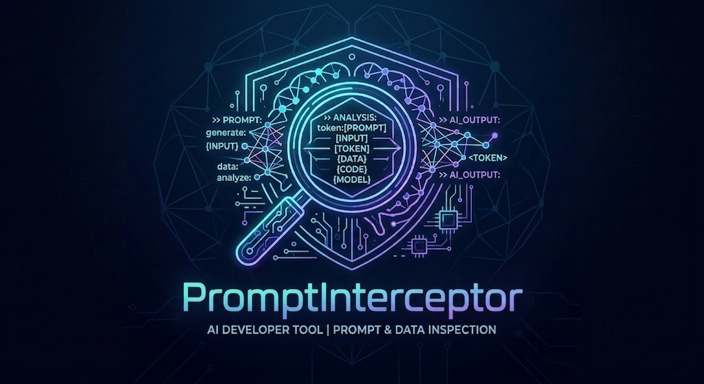

<p align="center">
  
</p>

<p align="center">Ollama Traffic Interceptor for AI Clients</p>

[Architecture](docs/architecture.md) · [API Reference](docs/api.md) · [Configuration](docs/configuration.md) · [Modifiers / Rules](docs/rules.md)

## Why use it

Local LLMs don't always behave perfectly. A model may ignore tool definitions, emit `tool_calls` in the wrong format, skip chain-of-thought entirely, or hallucinate the wrong model name. Your AI client expects clean, well-formed messages — and Ollama just passes whatever the model produces.

PromptInterceptor sits between your client and Ollama and can rewrite any field of any request or response in real time. Fix a malformed `tool_calls` array, inject a `thinking` block, force a specific model, cap the temperature — all without touching the client or restarting Ollama. The client and the model never know the proxy is there.

## Features

- **Tool call repair** — use modifier rules to fix or inject `tool_calls` fields when the model doesn't emit them correctly
- **Thinking / chain-of-thought injection** — add or rewrite `thinking` blocks in responses before they reach the client
- **Model switching** — silently reroute requests from one model to another using JSONPath rules
- **Temperature tuning** — override temperature or any other option on every request
- **Live prompt viewer** — see every request and response as it flows through the proxy
- **Intercept mode** — pause any request, edit the JSON body by hand, then forward or drop it
- **Modifier management** — create, enable, disable and delete rules from the dashboard without restarting
- **Windows bash mode** — automatically detects Windows and wraps LLM-generated Bash commands as `bash -c "..."`, so they run via Git Bash or WSL without any configuration
- **Only Proxy mode** — launch just the proxy and point any client at it manually
- **Open Code support** — auto-configures `~/.config/opencode/opencode.json` to point at the proxy
- **Python app support** — connect any Python app that uses Ollama by setting its host env var
- **Full traffic logging** — all requests and responses saved as JSON files with rotation
- **Desktop launcher** — guided tkinter window (Check Ollama → Client → Dashboard)
- **Streaming support** — transparent proxying of NDJSON streaming responses

## Installation

```bash
git clone https://github.com/your-user/PromptInterceptor.git
cd PromptInterceptor
pip install -r prompt_interceptor/requirements.txt
```

Requirements: Python 3.9+, Ollama installed and running.

## Usage

### Launch the desktop window

```bash
python -m prompt_interceptor
```

The launcher guides you through three steps. Each step unlocks the next.

---

### Step 1 — Check Ollama

| Field / Button | Description |
|---|---|
| **Ollama Host** | IP or hostname of the Ollama server (default: `127.0.0.1`) |
| **Check Ollama** | Connects to Ollama, fetches available models, and unlocks Step 2. Ollama must already be running (`ollama serve`). |

If the check fails, start Ollama manually and click **Check Ollama** again.

---

### Step 2 — AI Client

| Option | Description |
|---|---|
| **Only Proxy** _(default)_ | Starts the proxy without launching any client. Point your own tool at `http://localhost:8080`. |
| **Open Code (CLI)** | Auto-configures opencode to use the proxy and opens a terminal. |
| **Python App (Ollama)** | Launches a Python app with the Ollama host env var set to the proxy URL. |

| Field | Description |
|---|---|
| **Work Dir** _(Open Code)_ | Directory where the client terminal opens. |
| **App Dir** _(Python App)_ | Working directory for the Python app. |
| **Command** _(Python App)_ | Command to run the app (default: `python main.py`). |
| **Use venv** _(Python App)_ | Checkbox: auto-detects a `.venv` or `venv` folder in the App Dir and runs the command with that interpreter instead of the system Python. |
| **Ollama Env Var** _(Python App)_ | Env var the app uses for the Ollama host (e.g. `OLLAMA_HOST`). Set automatically to the proxy URL. |
| **Context Size** _(Python App)_ | Size of Ollama's context window passed as `OLLAMA_NUM_CTX` when launching Ollama. Options: 4k, 8k, 16k, 32k _(default)_, 64k, 128k, 256k. |

---

### Step 3 — Dashboard

Click **Open Dashboard** to launch the proxy server and open the dashboard at `http://localhost:9090`.

---

## Use cases

### Just the proxy — point your own client at it

1. Start Ollama: `ollama serve`
2. Run `python -m prompt_interceptor`
3. Step 1: click **Check Ollama**
4. Step 2: select **Only Proxy** → click **Launch Proxy**
5. Step 3: click **Open Dashboard**
6. Point your client at `http://localhost:8080` and open `http://localhost:9090` to monitor traffic

### Fix tool calls or thinking with a modifier

When a model sends `tool_calls: []` instead of the expected call, or skips the `thinking` block entirely, add a modifier rule in the dashboard to patch the response before it reaches the client.

Example — force a specific model on every request:

```json
{
  "match": {"path": "/api/chat"},
  "replace": {"jsonpath": "$.model", "value": "qwen2.5-coder:7b"}
}
```

Example — override temperature to reduce randomness:

```json
{
  "match": {"path": "/api/chat"},
  "replace": {"jsonpath": "$.options.temperature", "value": 0.1}
}
```

See [docs/rules.md](docs/rules.md) for the full modifier reference.

### Ollama + Open Code on Windows

Running Open Code on Windows with a local model? **No configuration needed** — the proxy detects Windows automatically and wraps every Bash tool call as `bash -c "..."` before it reaches Open Code.

1. Install [Git Bash](https://gitforwindows.org/) or enable WSL so that `bash` is available in `PATH`.
2. Start the proxy normally.
3. The proxy wraps commands like `ls -la` → `bash -c "ls -la"` transparently, without any changes to Open Code or the model. If `bash` is not found in `PATH`, a warning popup appears at startup.

### Ollama + Open Code

1. Start Ollama: `ollama serve`
2. Run `python -m prompt_interceptor`
3. Step 1: click **Check Ollama** — pick a model from the dropdown
4. Step 2: select **Open Code (CLI)**, choose a work directory → click **Launch Client**
5. Step 3: click **Open Dashboard**
6. Open Code starts with the proxy as its Ollama backend. All traffic is visible in the dashboard.

### Ollama + custom Python app

1. Start Ollama: `ollama serve`
2. Run `python -m prompt_interceptor`
3. Step 1: click **Check Ollama**
4. Step 2: select **Python App (Ollama)**, fill in:
   - **App Dir** — root folder of your app
   - **Command** — entry point (e.g. `python main.py`)
   - **Use venv** — check this if your app has a `.venv` or `venv` folder; the launcher will use that interpreter automatically
   - **Ollama Env Var** — the env var your app reads for the Ollama host (e.g. `OLLAMA_HOST`)
   - **Context Size** — how large a context window to give Ollama (default 32k; increase for long conversations)
5. Click **Launch Client**, then **Open Dashboard**
6. The app sends all Ollama traffic through `http://localhost:8080`

---

## Configuration

`config.json` is optional — the proxy starts with sensible defaults if the file is missing. To customize settings, copy the example and edit it:

```bash
cp prompt_interceptor/config.example.json prompt_interceptor/config.json
```

Edit `prompt_interceptor/config.json` with your settings:

```json
{
  "proxy_port": 8080,
  "target": "http://localhost:11434",
  "mode": "passthrough",
  "context_size": 32768,
  "default_model": "",
  "dashboard_enabled": true,
  "dashboard_port": 9090,
  "rules": []
}
```

See [docs/configuration.md](docs/configuration.md) for all available fields.

## API Endpoints

### Proxy (port 8080)

| Method | Path | Description |
|---|---|---|
| GET | `/health` | Health check |
| GET | `/status` | System status |
| POST | `/api/chat` | Chat completion |
| POST | `/api/generate` | Text generation |
| POST | `/api/chat/stream` | Streaming chat |
| POST | `/api/generate/stream` | Streaming generate |
| POST | `/v1/messages` | Anthropic-compatible messages |
| POST | `/v1/chat/completions` | OpenAI-compatible chat completions |
| ANY | `/{path}` | Pass-through: any unmatched path is forwarded to Ollama and logged |

### Dashboard (port 9090)

| Method | Path | Description |
|---|---|---|
| GET | `/` | Dashboard UI |
| GET | `/api/status` | Full system status |
| GET | `/api/health` | Proxy health |
| GET | `/api/target-health` | Ollama target health |
| POST | `/api/mode` | Change proxy mode |
| GET | `/api/rules` | List modifiers |
| POST | `/api/rules` | Create modifier |
| DELETE | `/api/rules/{index}` | Delete modifier |
| GET | `/api/logs` | Recent traffic logs |
| GET | `/api/raw-logs` | All logs (no limit) |
| POST | `/api/reset` | Clear logs and reset session |
| POST | `/api/intercept/{id}/forward` | Forward paused request |
| POST | `/api/intercept/{id}/edit` | Edit and forward |
| POST | `/api/intercept/{id}/drop` | Drop request |

See [docs/api.md](docs/api.md) for full details and examples.

---

PromptInterceptor — MIT License
