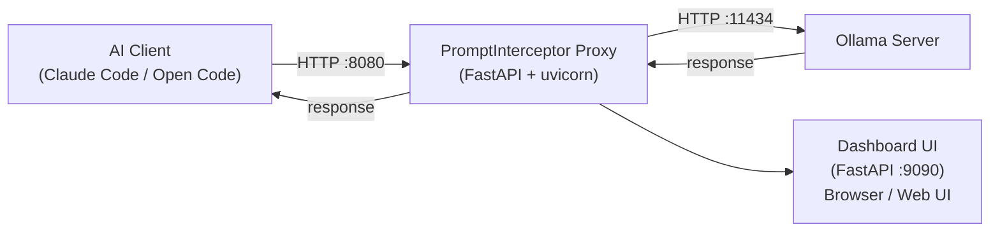
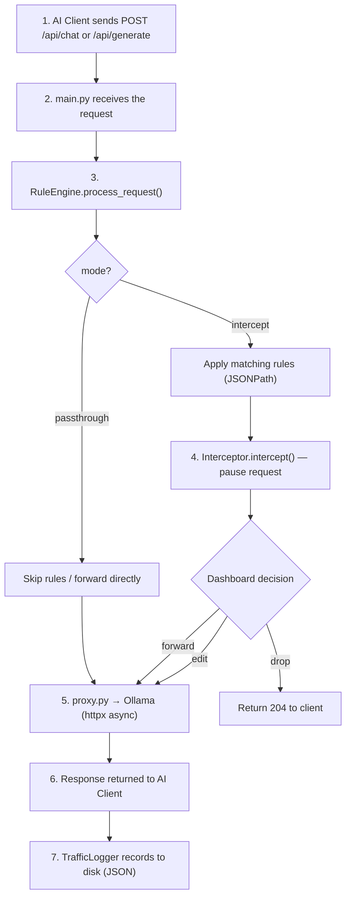

# Architecture

## Overview

PromptInterceptor sits between an AI client (Claude Code, Open Code) and an Ollama server, intercepting all HTTP traffic so that requests and responses can be inspected, modified, or paused for manual review.

## Request Flow

## Modules

| Module | Responsibility |
|--------|---------------|
| `main.py` | FastAPI app, routes, uvicorn entry point |
| `proxy.py` | HTTP forwarding, streaming support, error handling |
| `rules_engine.py` | JSONPath-based rule matching and value replacement |
| `config.py` | Pydantic config model, load/save config.json |
| `dashboard.py` | Web UI FastAPI app (port 9090), management API |
| `launcher.py` | tkinter desktop launcher, startup configuration |
| `interceptor.py` | Async pause/resume of in-flight requests |
| `logger.py` | Traffic logging to JSON files, rotation, stats |
| `health.py` | Health check and status endpoints |
| `cors_middleware.py` | CORS configuration |
| `models/request_model.py` | Pydantic models for Chat/Generate requests |
| `utils/json_utils.py` | JSONPath get/set, safe JSON parsing |
| `utils/streaming_utils.py` | Async streaming utilities (NDJSON) |

## Proxy Modes

### `passthrough` (default)
All requests are forwarded directly to Ollama. Rules are still applied.
Traffic is logged. No manual intervention required.

### `intercept`
Each request is paused before forwarding. The dashboard shows the pending
request and allows the user to:
- **Forward** — send unchanged
- **Edit & Forward** — modify the body JSON and send
- **Drop** — reject the request (returns 204 to the client)

Timeout: 30 seconds (auto-forward if no action taken).

## Configuration

The proxy and dashboard servers run as separate uvicorn instances in different
threads. They share state through the `config.json` file on disk — both servers
call `get_config()` on each request, which reads the file fresh each time.
This allows the dashboard to change settings (e.g., mode) that take effect
immediately on the proxy without a restart.
