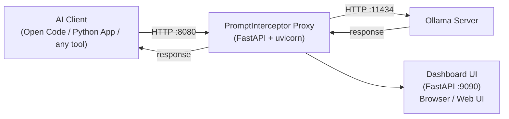
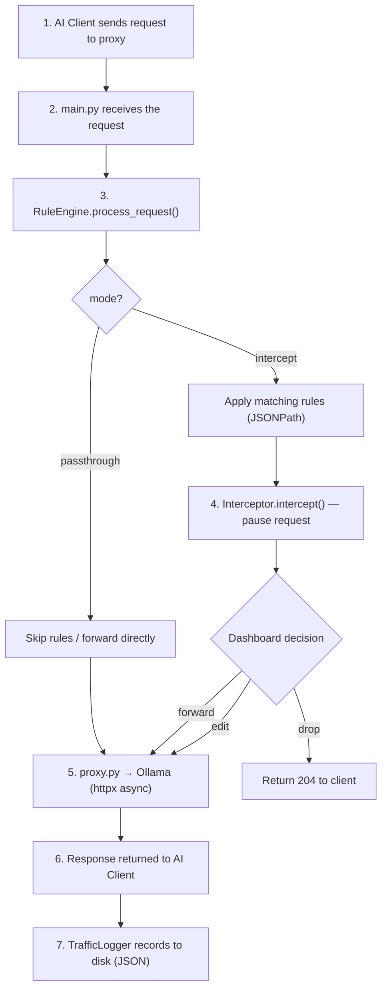

# Architecture

## Overview

PromptInterceptor sits between an AI client (Open Code, a custom Python app, or any Ollama-compatible tool) and an Ollama server, intercepting all HTTP traffic so that requests and responses can be inspected, modified, or paused for manual review.

## Request Flow

## Modules

| Module | Responsibility |
|--------|---------------|
| `main.py` | FastAPI app, routes, uvicorn entry point |
| `proxy.py` | HTTP forwarding, streaming support, error handling |
| `rules_engine.py` | JSONPath-based rule matching and value replacement |
| `config.py` | Pydantic config model, load/save config.json |
| `dashboard.py` | Web UI FastAPI app (port 9090), management API. Live Prompts table with a split-panel message detail modal (prompt left, thinking + response right). Raw toggle shows the complete JSON log entry. |
| `launcher.py` | tkinter desktop launcher: 3-step sequential UI (Ollama → Client → Dashboard), model list from Ollama `/api/tags`, work-dir or Python app configuration |
| `interceptor.py` | Async pause/resume of in-flight requests |
| `logger.py` | Traffic logging to JSON files, rotation, stats |
| `health.py` | Health check and status endpoints |
| `cors_middleware.py` | CORS configuration |
| `models/request_model.py` | Pydantic models for Chat/Generate requests |
| `utils/json_utils.py` | JSONPath get/set, safe JSON parsing |
| `utils/streaming_utils.py` | Async streaming utilities (NDJSON) |

## Proxy Modes

### `passthrough` (default)
All requests are forwarded directly to Ollama. **Rules are not applied.**
Traffic is logged. No manual intervention required.

### `intercept`
Rules are applied to each request before forwarding. The dashboard shows the pending
request and allows the user to:
- **Forward** — send unchanged
- **Edit & Forward** — modify the body JSON and send
- **Drop** — reject the request (returns 204 to the client)

Timeout: 30 seconds (auto-forward if no action taken).

## Launcher

The desktop launcher (`python -m prompt_interceptor`) uses a sequential 3-step workflow — each step unlocks the next.

### Step 1 — Check Ollama

| Field / Button | Behaviour |
|----------------|-----------|
| **Ollama Host** | IP or hostname of the Ollama server (default: `127.0.0.1`). |
| **Check Ollama** | Connects to Ollama, fetches the list of downloaded models, and unlocks Step 2. If the server is not running, start it manually with `ollama serve` and click again. |

### Step 2 — AI Client

| Field / Button | Behaviour |
|----------------|-----------|
| **AI Client** | Detected at startup. Available options: **Only Proxy** (always), **Open Code (CLI)** (if `opencode` is in PATH), **Python App (Ollama)** (always). |
| **Model** | Disabled until Ollama is ready. Populated from `GET /api/tags` (downloaded models only). |
| **Work Dir** *(Open Code CLI)* | Working directory where the client terminal opens. |
| **App Dir** *(Python App)* | Working directory for the Python app. |
| **Command** *(Python App)* | Command to run (default: `python main.py`). |
| **Use venv** *(Python App)* | Checkbox: auto-detects `.venv` or `venv` in App Dir and uses that interpreter. |
| **Ollama Env Var** *(Python App)* | Env var the app reads for the Ollama host (e.g. `OLLAMA_HOST`). Set to `http://localhost:<proxy_port>` at launch. |
| **Context Size** *(Python App)* | Sets `OLLAMA_NUM_CTX` passed to Ollama (4k–256k, default 32k). |
| **Launch Client** | Opens a terminal with the correct command and environment. **Open Code (CLI)**: writes `~/.config/opencode/opencode.json` with the proxy URL, launches `opencode` in a terminal. **Python App**: sets the configured env var to the proxy URL and runs the command. Unlocks Step 3. |

### Step 3 — Dashboard

| Button | Behaviour |
|--------|-----------|
| **Open Dashboard** | Saves config, starts the proxy + dashboard servers in background threads, opens the dashboard in the browser. Does **not** relaunch Ollama or the client. |

## Configuration

The proxy and dashboard servers run as separate uvicorn instances in different
threads. They share state through the `config.json` file on disk — both servers
call `get_config()` on each request, which reads the file fresh each time.
This allows the dashboard to change settings (e.g., mode) that take effect
immediately on the proxy without a restart.
