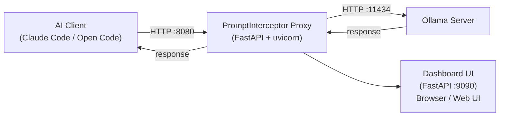
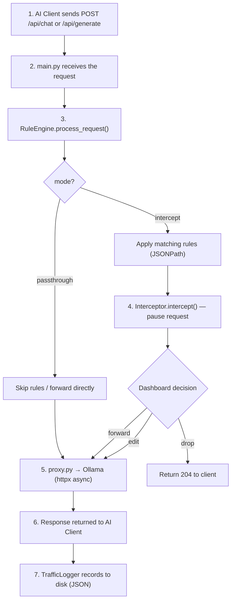

# Architecture

## Overview

PromptInterceptor sits between an AI client (Claude Code, Open Code) and an Ollama server, intercepting all HTTP traffic so that requests and responses can be inspected, modified, or paused for manual review.

## Request Flow

## Modules

| Module | Responsibility |
|--------|---------------|
| `main.py` | FastAPI app, routes, uvicorn entry point |
| `proxy.py` | HTTP forwarding, streaming support, error handling |
| `rules_engine.py` | JSONPath-based rule matching and value replacement |
| `config.py` | Pydantic config model, load/save config.json |
| `dashboard.py` | Web UI FastAPI app (port 9090), management API |
| `launcher.py` | tkinter desktop launcher: 3-step sequential UI (Ollama → Client → Proxy), context size, model list from Ollama `/api/tags`, work-dir or Python app configuration |
| `interceptor.py` | Async pause/resume of in-flight requests |
| `logger.py` | Traffic logging to JSON files, rotation, stats |
| `health.py` | Health check and status endpoints |
| `cors_middleware.py` | CORS configuration |
| `models/request_model.py` | Pydantic models for Chat/Generate requests |
| `utils/json_utils.py` | JSONPath get/set, safe JSON parsing |
| `utils/streaming_utils.py` | Async streaming utilities (NDJSON) |

## Proxy Modes

### `passthrough` (default)
All requests are forwarded directly to Ollama. Rules are still applied.
Traffic is logged. No manual intervention required.

### `intercept`
Each request is paused before forwarding. The dashboard shows the pending
request and allows the user to:
- **Forward** — send unchanged
- **Edit & Forward** — modify the body JSON and send
- **Drop** — reject the request (returns 204 to the client)

Timeout: 30 seconds (auto-forward if no action taken).

## Launcher

The desktop launcher (`python -m prompt_interceptor`) uses a sequential 3-step workflow — each step unlocks the next.

### Step 1 — Ollama Server

| Field / Button | Behaviour |
|----------------|-----------|
| **Context Size** | Sets `OLLAMA_NUM_CTX` env var passed to `ollama serve` (4k–256k). Default: 32k. |
| **Launch Ollama Server** | Checks if Ollama is already running. If yes, loads available models without opening a terminal. If no, opens a CMD terminal running `ollama serve`, waits ~2s, then fetches models. Unlocks Step 2 on success. |

### Step 2 — AI Client

| Field / Button | Behaviour |
|----------------|-----------|
| **AI Client** | Detected at startup. Always includes *Python App (Ollama)* as a custom option. Available clients: **Claude Code** (if `claude` is in PATH), **Open Code (CLI)** (if `opencode` is in PATH), **Open Code (WSL)** (if WSL is available *and* `opencode` is installed inside WSL). |
| **Model** | Disabled until Ollama is ready. Populated from `GET /api/tags` (downloaded models only). |
| **Work Dir** *(Claude Code / Open Code CLI / Open Code WSL)* | Working directory for the client terminal. For WSL, the Windows path is converted to a WSL path via `wslpath`. |
| **App Path** *(Python App)* | Path to the Python app's entry point (`.py` or executable). |
| **Ollama Env Var** *(Python App)* | Name of the environment variable the app uses for the Ollama host (e.g. `OLLAMA_HOST`). Set to `http://localhost:<proxy_port>` at launch. |
| **Launch Client** | Opens a terminal with the correct command and environment. **Claude Code**: sets `ANTHROPIC_BASE_URL=http://localhost:<proxy_port>`, launches `claude --model <model>` in CMD. **Open Code (CLI)**: writes `~/.config/opencode/opencode.json` with the proxy URL, launches `opencode --model ollama/<model>` in CMD. **Open Code (WSL)**: writes `~/.config/opencode/opencode.json` inside WSL (using the Windows host IP detected from `/etc/resolv.conf`), launches `wsl -- bash -c "opencode --model ollama/<model>"` in CMD. **Python App**: sets the configured env var to the proxy URL. Unlocks Step 3. |

### Step 3 — Proxy

| Button | Behaviour |
|--------|-----------|
| **Start** | Saves config, starts the proxy + dashboard servers in background threads, opens the dashboard in the browser. Does **not** relaunch Ollama or the client. |

## Configuration

The proxy and dashboard servers run as separate uvicorn instances in different
threads. They share state through the `config.json` file on disk — both servers
call `get_config()` on each request, which reads the file fresh each time.
This allows the dashboard to change settings (e.g., mode) that take effect
immediately on the proxy without a restart.
